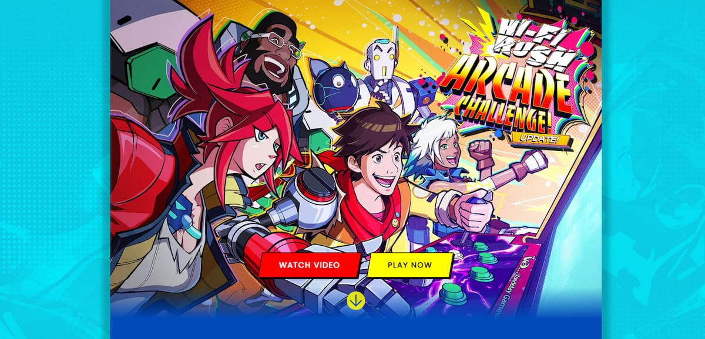
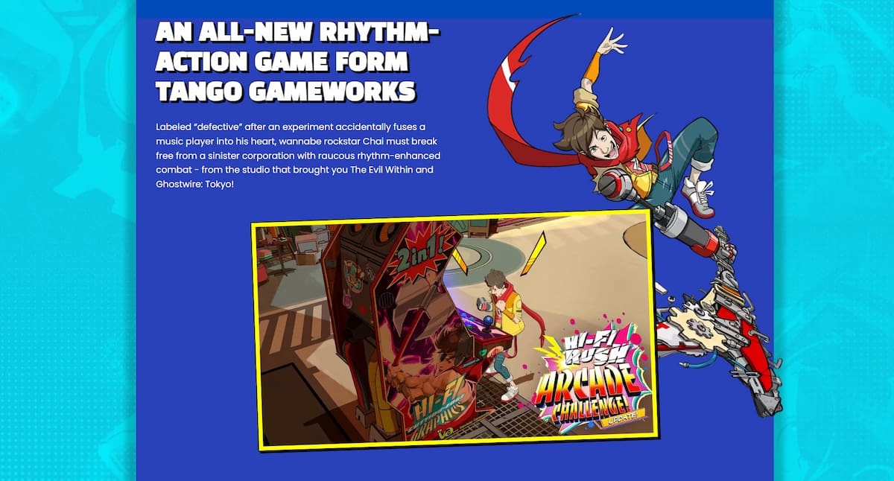
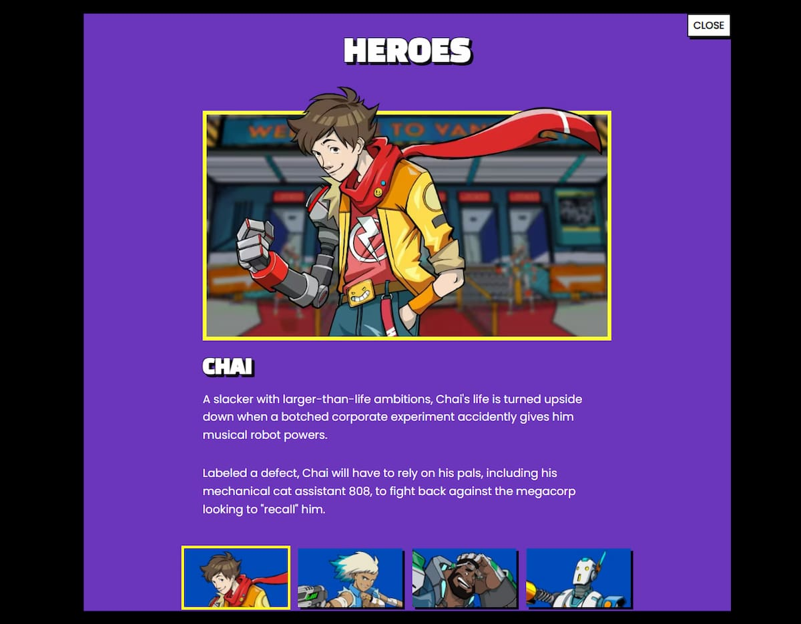
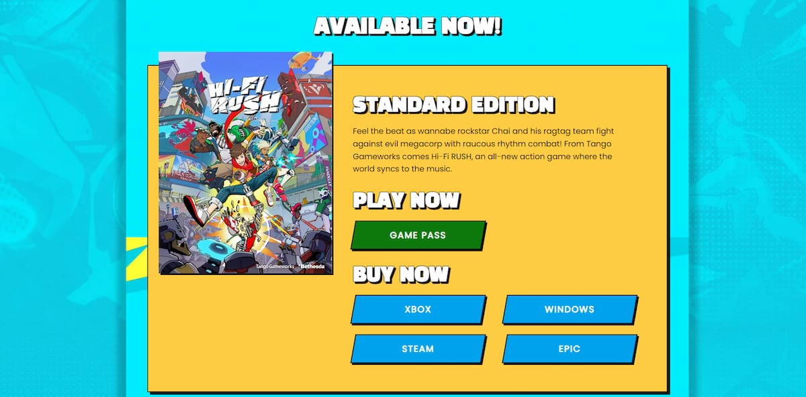

# Hi-Fi RUSH Clone Site

[View live site](https://apcurran.github.io/hi-fi-rush-clone/)

- Utilizes Popover API for hero, villain, and deluxe edition galleries

- Animates popover (in and out)

- Demonstrates tabbed galleries with character info

- Uses native CSS nesting, grid, flexbox, and custom properties

- Responsive layout

**Disclaimer -- All rights for Hi-Fi RUSH belong to Tango Gameworks & Bethesda Softworks. This is a clone website, with my own original code, for educational purposes only.**